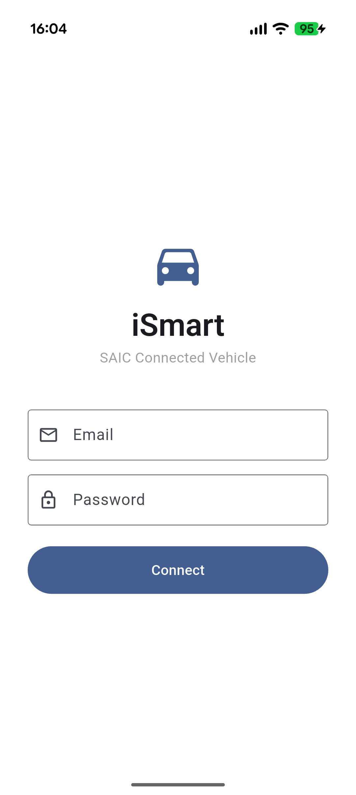
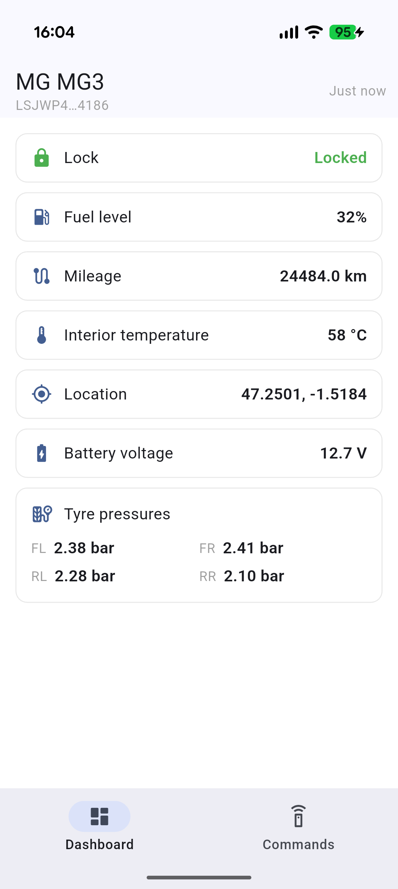
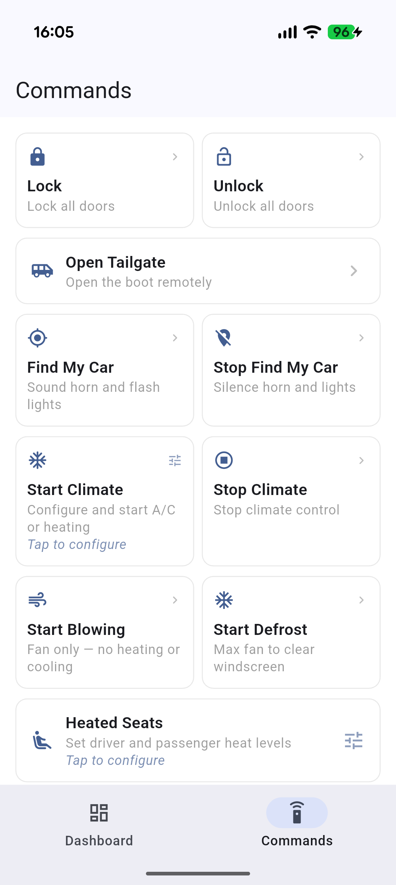
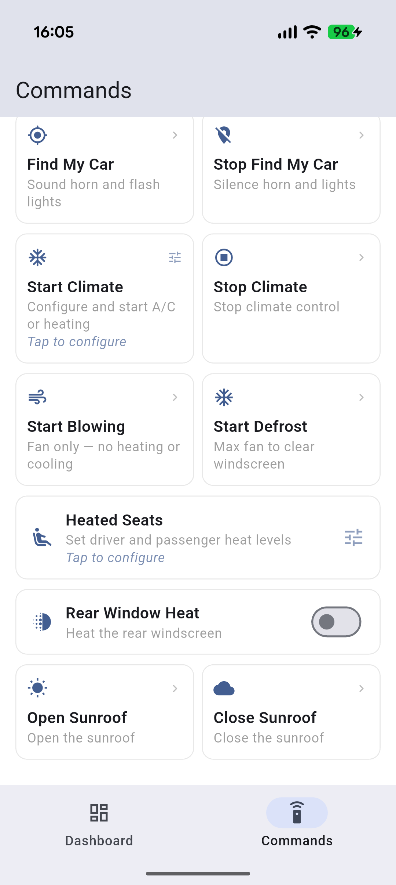

# saic_ismart

> Dart client for the SAIC iSmart API — MG, Roewe, Maxus/LDV connected vehicles.

[](https://pub.dev/packages/saic_ismart)
[](https://tanguymossion.github.io/saic_ismart/)
[](LICENSE)
[](https://dart.dev)

**v1.0.0 — ready for pub.dev.**

---

## What is this?

`saic_ismart` is a pure Dart package to interact with the SAIC iSmart connected vehicle API. It works for any vehicle compatible with the MG iSmart app — MG, Roewe, Maxus/LDV models.

It is the **first Dart/Flutter client** in the [SAIC-iSmart-API](https://github.com/SAIC-iSmart-API) open source ecosystem, alongside the existing Python and Java clients.

Pure Dart — no Kotlin, no Swift, no native code. Works in Flutter mobile, Wear OS, desktop, or any Dart project.

---

## Supported vehicles

| Brand | Models | Regions | Status |
|---|---|---|---|
| **MG** | MG3 Hybrid, MG4 EV, MG5 EV, MG ZS EV, MG HS Plug-in… | EU (tested), AU, IN, TR, Rest of World (untested — community welcome) | MG3 Hybrid tested (dev device) |
| **Roewe** | RX5 eMax, ei6 MAX… | EU, CN | Expected — needs contributor |
| **Maxus / LDV** | eT60, eDeliver… | EU | Expected — needs contributor |

EV-specific features (SoC, charging management, climate) require a contributor with the right hardware. See [Contributing](#contributing).

---

---

## Quick start

> Prerequisites: You need an existing SAIC iSmart account. Account creation is only available through the official MG iSmart app.

```yaml
# pubspec.yaml
dependencies:
  saic_ismart: ^1.0.0
```

```dart
import 'package:saic_ismart/saic_ismart.dart';

final client = SaicClient(
  SaicConfig(username: 'you@example.com', password: '••••••••'),
);

await client.login();

final vehicles = await client.getVehicles();
final status   = await client.getVehicleStatus(vehicles.first.vin);

print(status.basicVehicleStatus?.lockState);             // LockStatus.locked / .unlocked
print(status.basicVehicleStatus?.mileageKm);             // kilometers
print(status.gpsPosition?.wayPoint?.position?.latitude); // raw integer ÷ 1,000,000 = degrees
```

### Exception handling

All client methods throw typed exceptions — `SaicAuthException` for bad credentials or expired sessions, `SaicSessionConflictException` when another session is already active, `SaicTimeoutException` when the vehicle does not respond in time, `SaicNetworkException` for connectivity failures, and `SaicApiException` for API-level errors (e.g. code 3 = climate active, code 8 = feature unavailable).

```dart
try {
  await client.login();
  final vehicles = await client.getVehicles();
  final status = await client.getVehicleStatus(vehicles.first.vin);
} on SaicAuthException catch (e) {
  // Invalid credentials or session expired
  print('Auth error: ${e.message}');
} on SaicSessionConflictException {
  // Another session is active (e.g. official iSmart app)
  print('Session conflict — try again in a few minutes');
} on SaicTimeoutException {
  // Vehicle did not respond in time
  print('Vehicle timeout');
} on SaicNetworkException catch (e) {
  // Network error
  print('Network error: ${e.message}');
} on SaicApiException catch (e) {
  // API error (e.g. code=3 climate active, code=8 feature not available)
  print('API error code ${e.code}: ${e.message}');
}
```

---

## Real-world output

```
✓ Logged in as user@example.com, token expires at 2026-11-19 15:33:12
✓ Found 1 vehicle(s)
  - MG MG3 2023 (VIN: LSJXXXXXXXXXXXXXXX)
✓ Vehicle status:
  Locked: 1
  Engine running: false
  Parked: true
  Mileage: 243790
  Fuel level: 45%
  Location: 47.XXXXXX, -1.XXXXXX
  GPS status: GpsStatus.fix2d
  Status time: 1779548697
```

---

## Important: API constraints

**Single session** — The SAIC API allows only one active session at a time. Calling this package will pause the official iSmart app for ~900 seconds. The client handles this automatically, but be aware of it if you use the official app alongside.

**600 s cooldown** — The API enforces a minimum delay between vehicle data requests to protect the 12V battery. The client includes a built-in cache that respects this limit. Do not bypass it.

**No real-time data** — Vehicle status is polled, not streamed. Data reflects a snapshot, not a live feed.

---

## Example app

| Login | Dashboard | Commands (1/2) | Commands (2/2) |
|---|---|---|---|
|  |  |  |  |

---

See the full [CHANGELOG](CHANGELOG.md) for details.

## Roadmap

### ✅ v0.1.0 — Foundations · released 2026-05-23
- Auth + token refresh
- `getVehicles()`, `getVehicleStatus(vin)`
- Cache/cooldown + session conflict handling
- EU region
- Tested on MG3 Hybrid EU

### ✅ v0.2.0 — Extended data & multi-region · released 2026-05-24
- Tyre pressure, window & door state
- Vehicle alert model (`VehicleAlertInfo`)
- Multi-region (AU, IN, TR, Rest of World)
- Structured errors — `SaicException`
- Unit conversion helpers & convenience getters

### ✅ v1.0.0 — Remote actions · released 2026-05-30
- Remote lock/unlock, tailgate
- Find my car (horn + lights)
- Remote climate: A/C, heat, blow, defrost, heated seats, rear window heat, sunroof
- Session lifecycle: `logout()`, `isLoggedIn`, `tokenExpiration`
- Full docs + example Flutter app
- Published on pub.dev

### v1.x — EV features _(community-driven)_
- Battery SoC (MG4, ZS EV…)
- Charge management — start/stop/schedule
- Remote climate control
- Battery heating

---

## Contributing

**Own an MG4, ZS EV, Roewe or Maxus/LDV?**

EV features can't be developed without the right hardware. If you want to contribute:

1. Open an issue describing your vehicle model and region
2. Check if the iSmart app works for your vehicle
3. Let's build the feature together

This project is based on the reverse engineering work by the [SAIC-iSmart-API](https://github.com/SAIC-iSmart-API) community.

---

## Legal

This package uses the SAIC iSmart API for interoperability purposes, as permitted under the iSmart EULA and EU software directive 2009/24/CE. It is not affiliated with or endorsed by SAIC Motor.

Do not use this package for commercial services that resell SAIC vehicle data without appropriate agreements.

---

## Acknowledgements

Built on top of the reverse engineering work done by the [SAIC-iSmart-API](https://github.com/SAIC-iSmart-API) community — in particular the Python and Java clients which served as reference implementations.
